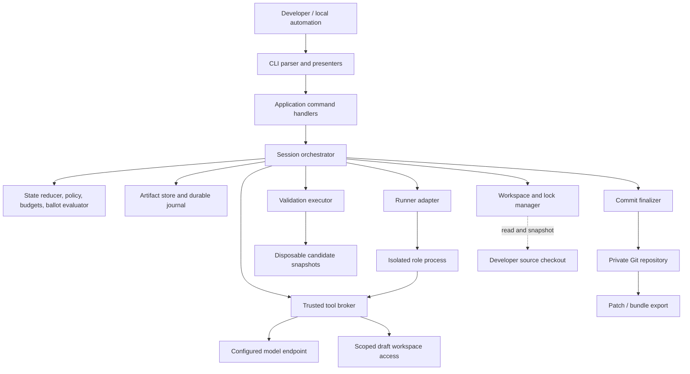
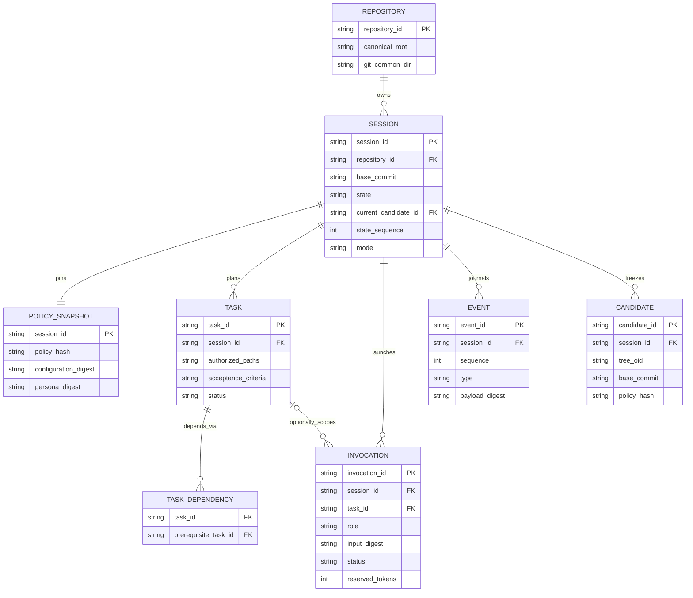
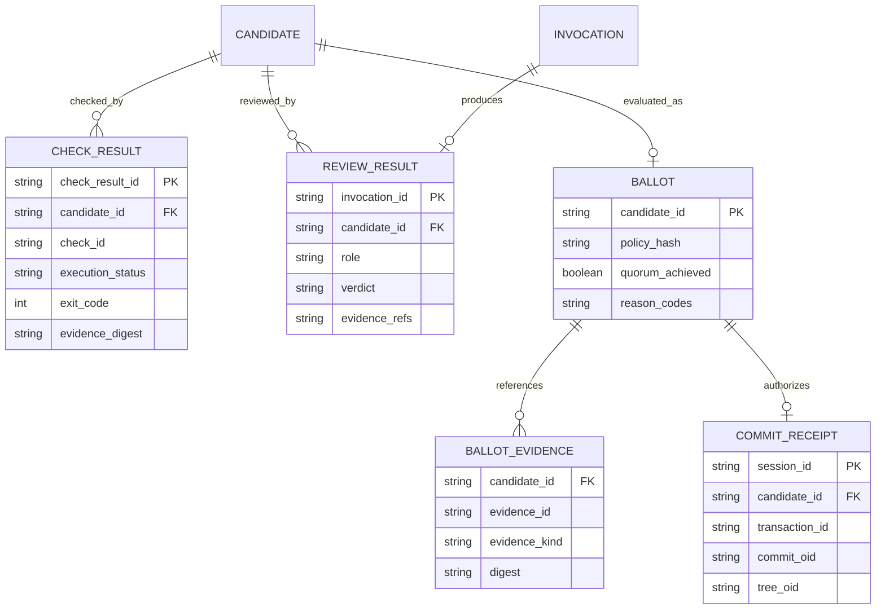
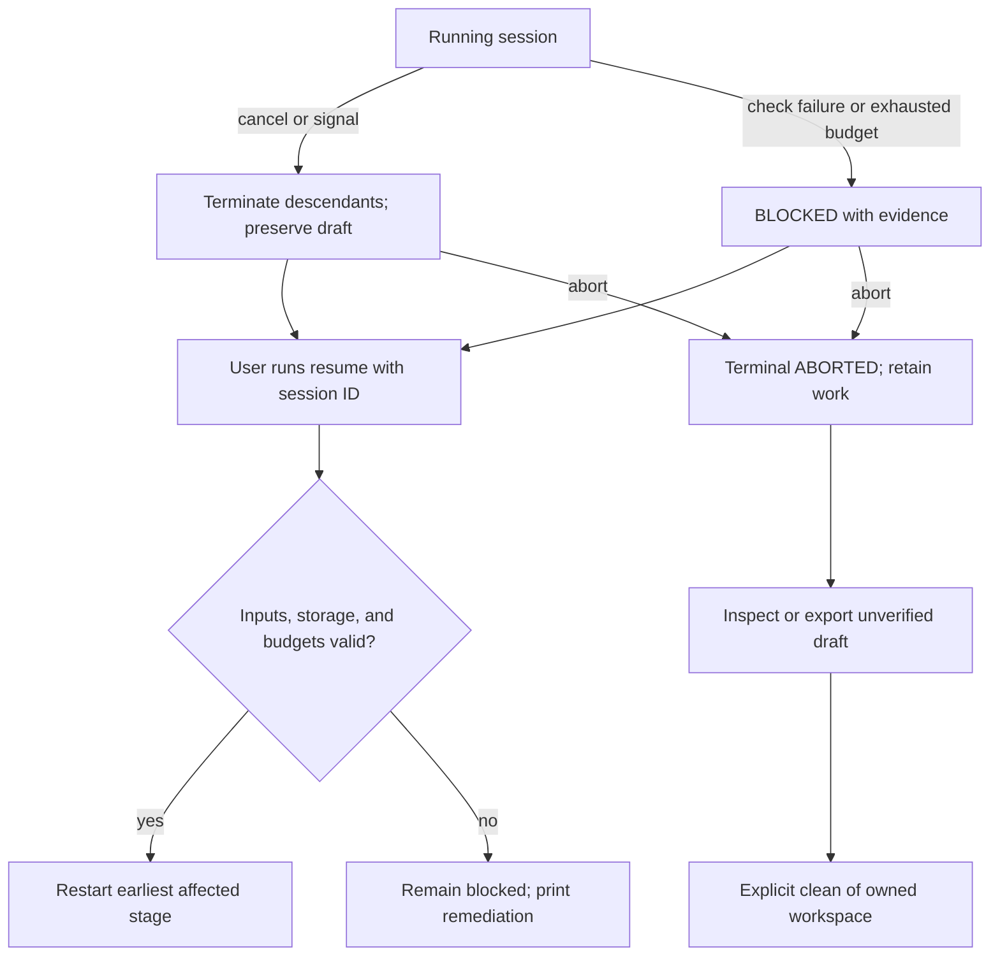

# Quorum System Design

**Status:** Draft implementation design  
**Aligned with:** [PRD.md](PRD.md), version 2.2.0\
**Audience:** Implementers and reviewers of the CLI and orchestration engine

## 1. Scope and Design Decisions

Quorum is a local CLI application, not a website. Its user interface consists of commands, terminal views, JSON responses, and exported artifacts. No screen routing or `SITE_MAP.md` is required. Section 7 defines command navigation and output components instead.

The PRD owns product requirements. This document specifies implementation boundaries and contracts; [AGENTS.md](AGENTS.md) instructs the AI agent implementing them. The [foundation report](docs/implementation/foundation.md) identifies the currently implemented subset. Paths and interfaces beyond that subset remain proposed, not claims that code exists.

| Decision | MVP choice | Reason |
| :--- | :--- | :--- |
| Application | TypeScript CLI in one npm package | Small deployable unit; matches the first supported repository stack |
| Orchestration | Explicit state machine with a pure transition reducer | Predictable retries, review invalidation, and replay |
| Storage | Private JSON artifacts and append-only JSONL journal | Local operation without a database service |
| Parallelism | One session per repository; serial tasks | Avoid conflicting mutations and integration complexity |
| Agent integration | Antigravity (`agy`) and Codex adapters behind one versioned interface; one selected runner per session | Prioritize daily-driver workflows; verify each integration independently |
| Isolation | Container execution plus host tool broker | Enforce filesystem, process, network, and credential boundaries |
| Commit | One commit in a private repository; explicit export | Preserve the source checkout and index |
| Validation | Deterministic checks plus independent QA/security reviews | Separate executable evidence from model judgment |

No cloud control plane, web API, account system, queue service, vector store, or relational database is needed. The ERDs describe logical records stored in artifacts.

## 2. Architecture and Trust Boundaries



The source checkout is input, not an execution workspace. Repository programs and model output are untrusted. Host artifact storage, effective policy, private Git metadata, model credentials, and runtime control sockets are inaccessible to role/check processes. The broker is the only path from a role to a privileged effect. Model access and repository check execution use separate environments.

### 2.1 Module boundaries

```text
src/
  cli/             # Argument parsing and text/JSON presenters
  application/     # Command handlers and orchestration use cases
  domain/          # Pure state transitions, policy, budgets, candidate/ballot rules
  contracts/       # Runtime schemas and generated/inferred TypeScript types
  infrastructure/
    artifacts/     # Journal, atomic persistence, hashes, retention
    workspace/     # Source snapshots, ownership checks, locks
    sandbox/       # Isolation profiles, execution, cancellation
    git/           # Private repository operations and finalization
    adapters/      # Protocol adapter and runner-specific implementation
  broker/          # Grant checks and typed role tool dispatch
  prompts/         # Versioned runtime role templates
schemas/           # Generated JSON Schema exports
tests/             # Proposed: unit/, integration/, conformance/, fixtures/
```

Create directories as functionality requires them, not as empty scaffolding.

Dependencies point inward: CLI → application → domain/contracts. Infrastructure implements ports defined by application/contracts. Domain logic cannot import filesystem, subprocess, network, CLI, or runner SDK modules. A single composition root wires dependencies. Do not introduce a plugin framework for the first adapter.

## 3. Logical Data Model and ERDs

### 3.1 Execution records



Task identifiers are unique within a session; physical keys use `(session_id, task_id)`. Dependency endpoints must belong to that session. `current_candidate_id` is nullable before the first freeze. Session records without a complete preflight may have no policy snapshot yet; the one-to-one policy relationship applies to initialized sessions. Git repository identity resolves the common Git directory so alternate worktree paths cannot bypass locking.

### 3.2 Approval records



A check result is a host-authored execution record; it is not a model vote. Review rows in this diagram represent final reviews only. Design clearance uses separate contract-input digests. Ballot evidence references exactly one typed check/review artifact and its digest. A session can finalize only one candidate. Repeated evaluation of unchanged evidence is idempotent; a cached ballot never replaces recomputation.

### 3.3 Artifact mapping and retention

| Record | Storage | Writer |
| :--- | :--- | :--- |
| Repository identity/lock | Host-managed registry keyed by canonical repository ID | Workspace manager |
| Session projection | `.quorum/sessions/<id>/state.json` | Orchestrator |
| Events | `events.jsonl` in the session directory | Journal writer |
| Frozen policy | `inputs/policy.json` plus digest | Orchestrator |
| Plan/tasks | `motion.json` | Broker after plan validation |
| Invocation metadata/output | `invocations/<id>/` | Broker/adapter supervisor |
| Contract review | `contracts/<digest>/` | Broker |
| Candidate | `candidates/<id>/manifest.json` and `candidate.diff` | Snapshot service |
| Check/review result | Candidate `checks/` and `reviews/` | Executor/broker |
| Ballot | Candidate `ballot.json` | Ballot evaluator |
| Finalization intent/receipt | `finalization.json`, `receipt.json` | Finalizer |
| Escalation | `escalation.json` | Orchestrator |

Artifacts are local-user-only and excluded from commits. Retain until explicit cleanup. `clean` deletes owned workspaces, not the audit records by default. Once a resumable session's workspace is deleted, record `workspace_available: false`; `resume` blocks rather than reconstructing missing uncommitted work silently. Cleanup must disclose loss of the only local commit/draft and require explicit confirmation or an explicit noninteractive deletion flag. It must never follow links out of the owned workspace.

## 4. State, Persistence, and Candidate Integrity

The state names and transitions in PRD Section 3 are authoritative. Implement `transition(state, event) -> nextState | DomainError` as a pure function. Timers, random IDs, Git operations, and tool execution happen outside the reducer and enter as recorded events.

### 4.1 Durable mutation protocol

1. Acquire the repository lease and command execution lock; compare the expected state sequence.
2. Validate the command, authorization, stage, input digests, and remaining budget.
3. Persist an intent event before invoking an external effect.
4. Execute the effect with a stable operation ID and scope.
5. Persist immutable result artifacts using temporary files on the same filesystem, flush, rename, and directory flush where supported.
6. Append/flush the completion event, then update the rebuildable `state.json` projection.
7. Release the process lock. Keep the session lease until completed/aborted or explicitly handed off.

The journal is the transition authority; `state.json` is a cache. Sequence numbers must be contiguous. An incomplete trailing journal write is recoverable only to the last validated record; internal corruption blocks. Never parse damaged output as a successful empty result. Storage failure stops new work.

A repository lease prevents a new session while an approved, blocked, or cancelled session remains resumable. A short-lived execution lock prevents two commands from mutating the same session simultaneously. Record process identity, host boot identity where available, and ownership nonce; PID alone is insufficient for stale-lock recovery. Read-only status can run concurrently and reports its observed sequence.

### 4.2 Candidate freeze and invalidation

The draft workspace is mutable only through the broker. Freezing stops mutations, checks the scope, and records the proposed tree in private Git storage. Validate files against the allowlist, including deletions, renames, executable mode changes, and symlink targets. MVP blocks submodules and Git LFS-dependent content until explicitly supported.

`candidate_id = sha256(canonical candidate identity payload)`. The payload includes session ID, Git object format, base/tree OIDs, policy hash, plan/acceptance digest, contract/test digests, validation environment digest, and adapter/model/persona versions. Exclude timestamps, generated diffs, results, ballots, and the candidate ID itself. Canonical serialization must have one implementation and test vectors covering key order, Unicode, arrays, and rejected non-finite values. Git IDs are opaque validated identifiers with their object format, not assumed to be 40 characters.

All final checks use disposable copies of the frozen tree. Any content or relevant-input change starts a new revision, returning to the earliest affected stage. No final evidence is reused across revisions in MVP. While collecting reviews, unexpected mutation blocks immediately.

### 4.3 Finalization transaction

Persist `transaction_id`, approved tree, parent, commit message, author/committer identity, and timestamps before constructing a commit. With hooks and inherited Git configuration disabled, create the commit object deterministically, journal its OID, and update the private session branch with a compare-and-swap ref operation. Persist the receipt only after checking the tree and parent. Recovery locates or recreates the identical commit object and verifies the expected branch target; it never repeats a broad `git commit` blindly.

The source checkout may change outside Quorum's lock. Recheck source HEAD and imported-input digests immediately before finalization and record the observation. Quorum cannot lock arbitrary human edits; its safety guarantee is the private approved tree and preservation of source files, not prevention of external edits. Source divergence detected before completion blocks export as a current-base verified result; the original immutable evidence remains inspectable.

## 5. Contract and Schema Specification

Use one runtime schema definition per record, infer TypeScript types from it, and generate published JSON Schemas. Do not maintain separate handwritten TypeScript and JSON definitions. Select the schema library during scaffolding and pin it; this design does not prescribe an unverified dependency version.

The initial implementation uses pinned Zod definitions and generated JSON Schema for configuration, session, errors, and transition/events. Cross-field semantic checks remain runtime refinements. [The contract decision](docs/decisions/foundation-contracts.md) specifies canonical serialization version 1 and current reducer/replay limits. Remaining inventory records below are not implemented yet and must be validated before their use cases are connected.

### 5.1 Shared rules

- Every persisted/protocol object has `schema_version` or `protocol_version`; start at `1.0.0`. Reject unknown major versions and unknown security-relevant fields.
- IDs are bounded opaque strings generated by the host; role output cannot choose session, role, or invocation identity.
- Digests use an algorithm prefix; times use UTC RFC 3339. Durations are nonnegative integer milliseconds; counts are nonnegative safe integers.
- Artifact references are IDs plus digests, not arbitrary paths or URLs. The host resolves them inside owned storage.
- Boundary values are parsed from `unknown`; TypeScript casts do not validate input.
- Discriminated unions enforce required fields: final reviews require `candidate_id`; rejection requires findings; an incomplete result requires a reason.

| Schema | Required payload beyond version | Semantic validation |
| :--- | :--- | :--- |
| `RepositoryConfig` | adapter/version/model, mode, image digest, command definitions, path rules, budgets | No credential values; executable plus argument array; immutable effective snapshot |
| `SessionState` | IDs, state, sequence, base, budget ledger, current input refs | Valid transition; no negative budget; candidate required after freeze |
| `Motion` | tasks, dependencies, criterion IDs, risk, scoped paths | Acyclic; references resolve; every criterion has an owner |
| `CandidateManifest` | identity payload, candidate ID | Recompute hash and tree; reject out-of-scope changes |
| `InvocationRequest` | host identity, role, phase, input refs/digest, grants, response schema, limits | Grants are intersection of role policy and task scope |
| `InvocationResult` | execution status, usage, output ref, normalized error if failed | Bound to host invocation; usage cannot exceed unreserved allowance |
| `CheckResult` | candidate, check ID, execution status, exit code or null, duration, evidence refs | Passed requires completed execution, zero exit, valid discovery/report |
| `ReviewResult` | candidate, role, verdict, findings, evidence refs | QA/security only for final ballot; all references must match candidate |
| `Ballot` | candidate, policy hash, result refs, reasons, computed outcome | Host-only derivation; no trust in submitted outcome |
| `Event` | ID, sequence, previous digest, event type, payload, timestamp | Single writer; hash chain detects accidental corruption, not hostile host tampering |
| `CommitReceipt` | transaction, session, candidate, commit/tree/parent OIDs | Actual private Git objects must match |

Example model-produced review body (the host adds identity and version fields):

```json
{
  "verdict": "REJECTED",
  "findings": [
    {
      "criterion_id": "AC-2",
      "severity": "blocking",
      "path": "src/token-store.ts",
      "message": "Revoked tokens remain accepted after restart.",
      "evidence_refs": ["check-restart-01"]
    }
  ],
  "evidence_refs": ["check-restart-01"]
}
```

Verdicts are `APPROVED | REJECTED | INCOMPLETE`. Execution status is `SUCCEEDED | FAILED | TIMED_OUT | CANCELLED | PROTOCOL_ERROR`. `SUCCEEDED` only describes process/protocol completion, never product approval. A result may be successfully delivered while its verdict is rejected.

### 5.2 Adapter port

```typescript
interface RunnerAdapter {
  discover(signal: AbortSignal): Promise<Capabilities>;
  invoke(request: InvocationRequest, signal: AbortSignal): Promise<InvocationResult>;
  cancel(invocationId: string): Promise<CancellationReceipt>;
}
```

`Capabilities` must describe exact runner/model versions, structured output, broker-only tools, process-tree termination, usage reporting, enforceable token ceilings, and supported isolation profile. `CancellationReceipt` records descendant termination or failure to confirm it. Unsupported enforcement yields a capability error, not a permissive fallback. The feasibility spike must prove a compatible model/runner combination before an adapter is advertised as working. Antigravity (`agy`) and Codex are the initial targets. Record the actual integration surface, executable/API contract, authentication, and pinned versions separately for each; `agy` is a target label until verified. Implement both through this port and the existing broker, without runner-specific policy or approval paths. Session configuration selects one adapter; automatic fallback and mixing runners within a session are outside MVP. A failure on one target cannot be covered by conformance evidence from the other.

### 5.3 Role tools and local application API

These are internal typed operations, not public HTTP endpoints. The broker attaches authenticated invocation context out of band. An agent cannot pass `role`, `session_id`, grant overrides, shell commands, or a host working directory to acquire authority.

| Tool | Input | Output | Granted to / effect |
| :--- | :--- | :--- | :--- |
| `repo.read` | `{path, offset, limit}` | `{content, digest, truncated}` | Scoped read for active roles |
| `repo.search` | `{query, paths, limit}` | `{matches, truncated}` | Bounded search; no shell expansion |
| `artifact.read` | `{artifact_id}` | `{payload, digest}` | Only supplied input/evidence references |
| `draft.apply_patch` | `{expected_draft_digest, patch}` | `{draft_digest, changed_paths}` | Dev/refactor implementation paths; QA test paths in test-authoring phase |
| `checks.run` | `{check_id, input_digest}` | `{execution_id, status, evidence_ref}` | Only configured checks; no caller-supplied executable/args |
| `role.submit` | `{body}` | `{result_ref}` | Exactly one validated role/phase output; host wraps identity |
| `scope.request` | `{paths, reason}` | `{request_ref, status}` | Records a request; cannot grant access itself |

Patch application rejects traversal, absolute paths, links escaping scope, stale draft digests, protected paths, oversized content, and unsupported binary changes. Checks that execute repository code always run in the validation sandbox, including checks requested during implementation. Submission is immutable; repeat identical submission is idempotent, conflicting submission is a protocol error.

Host-only application operations are `createSession`, `resumeSession`, `cancelSession`, `abortSession`, `freezeCandidate`, `evaluateBallot`, `finalizeSession`, `exportSession`, and `cleanWorkspace`. They require validated user command context, an expected state sequence, and an idempotency/operation ID for mutations. None is exposed as a role tool.

Errors use `{code, message, retryable, remediation, details_ref?}`. Minimum codes: `INVALID_INPUT`, `CAPABILITY_MISSING`, `SCOPE_DENIED`, `STALE_INPUT`, `LOCKED`, `BUDGET_EXHAUSTED`, `CHECK_FAILED`, `REVIEW_REJECTED`, `EVIDENCE_INVALID`, `SOURCE_DIVERGED`, `STORAGE_FAILED`, and `CANCELLED`. Retryability is a host policy decision, not a model suggestion.

## 6. Core User Journeys and Explicit Flows

### 6.1 First setup

**Goal:** Configure a repository without changing its code or existing configuration.

1. Developer installs the released CLI and runs `quorum init`.
2. CLI detects repository/root, explains isolation and provider data transmission, and writes only missing configuration/persona templates.
3. Existing settings are preserved; missing validation commands are shown as configuration work, not guessed as passing checks.
4. Developer selects Antigravity (`agy`) or Codex, configures its pinned adapter/version/model, validation image, and commands, then runs `quorum doctor`.
5. Doctor reports capabilities individually. Missing credentials, isolation, model budgets, or tooling produce actionable failures before a paid invocation.
6. Success leads to `quorum run`; explicit advisory operation remains visibly unverified.

Noninteractive setup requires explicit flags/configuration for necessary choices. It never waits indefinitely for terminal input or silently chooses advisory mode.

### 6.2 Standard change, inspect, commit, export

```mermaid
sequenceDiagram
    actor User
    participant CLI
    participant Engine
    participant Roles
    participant Checks
    participant Git
    User->>CLI: run objective
    CLI->>Engine: validate configuration and acquire lease
    Engine->>Git: read source base; create private checkout
    Engine->>Roles: plan, QA tests, Dev implementation
    Engine->>Engine: freeze candidate and reserve check budget
    Engine->>Checks: validate exact candidate
    Checks-->>Engine: immutable check evidence
    Engine->>Roles: independent final QA and security reviews
    Roles-->>Engine: separate structured verdicts
    Engine->>Engine: recompute ballot
    Engine-->>CLI: APPROVED or BLOCKED
    User->>CLI: diff / status
    User->>CLI: commit --session id
    CLI->>Engine: validate authorization and current evidence
    Engine->>Git: finalize exact approved tree privately
    Git-->>Engine: verified receipt
    Engine-->>User: commit ID and export command
    User->>CLI: export --format bundle
    CLI-->>User: portable artifact; source checkout unchanged
```

`run --commit` combines the explicit commit request with the initial command. It does not skip checks. `run` alone returns after approval and prints the session ID and next commands. Exporting an unapproved draft labels it unverified and cannot create a verified commit marker.

### 6.3 Sensitive change and repair

1. Planning/path policy identifies a sensitive contract change.
2. Architecture emits contracts; security approves or rejects the design inputs.
3. Rejection consumes the appropriate repair budget and returns rationale to the owner.
4. QA and Dev proceed only after design clearance.
5. A security problem in final code still rejects the candidate, even if design clearance exists.
6. Repair unfreezes through a new draft revision; all final evidence is invalidated.
7. Exhaustion blocks with the failure, consumed budget, and explicit next action. No automatic gate relaxation.

### 6.4 Dirty checkout

Default run snapshots committed HEAD and prints excluded local changes. If the requested work depends on those changes, the session blocks instead of pretending they were included. The developer may start with `--include-dirty`; the inclusion list is presented before execution and must explicitly select untracked files. Noninteractive invocation requires a supplied inclusion selection. Only the isolated copy changes. Concurrent edits during capture invalidate the snapshot. Original staging distinctions are recorded for preservation checks; the eventual candidate is a single combined tree.

### 6.5 Cancel, repair, resume, abort



An operator may edit a blocked private workspace through an explicit import procedure; capture the new digest and invalidate evidence before resume. Editing source files is not silently imported. Raising a budget is a logged configuration action and never resets spent counters. Resume after a finalization crash first reconciles the existing transaction before scheduling new effects.

### 6.6 Direct role invocation

`dispatch /sec` reads a specified session snapshot and returns a standalone report. It cannot vote or finalize. Direct Dev/refactor work uses a separate isolated draft and protected-path policy. Adoption requires an explicit new revision and the full workflow. `/git` resolves only to the same validated `commit` handler. No hidden fast path exists.

## 7. CLI Navigation and Presentation Hierarchy

| Command/view | Primary content | Next actions |
| :--- | :--- | :--- |
| `init` | Configuration location, preserved files, missing setup | `doctor` |
| `doctor` | Runtime/adapter/check capability table | Fix configuration, `run` |
| `run` | Session ID, current stage, budget, latest meaningful event | `status`, `cancel` |
| `status` | State, candidate, gates, usage, blocking reason | `diff`, `resume`, `commit`, `abort` |
| `diff` | Base/candidate identifiers, scoped patch, verification status | `status`, `commit`, `export` |
| `resume` | Invalidated inputs, selected restart stage, remaining budget | `status`, `cancel` |
| `commit` | Current gate result or verified commit receipt | `export` |
| `export` | Format, output path, digest, verified/unverified label | Import outside Quorum; `clean` |
| `cancel` / `abort` | Process termination status and retained workspace | `resume` only if cancelled; inspect/export |
| `clean` | Exact owned workspace and loss-of-data notice | Explicit deletion or cancellation |
| `dispatch` | Role, snapshot, standalone report/draft status | Inspect or adopt through normal workflow |

Presentation composition: `CommandView → SessionHeader + StageProgress + GateTable + BudgetSummary + DiagnosticSummary + NextActions`. These are terminal presenter functions, not a component framework. JSON mode emits one versioned result on stdout; progress/logging uses stderr. Escape terminal control characters in repository/model text. Respect non-TTY operation and avoid color-dependent meaning. Read-only views never implicitly resume a session.

## 8. Technical Edge Cases and Expected Behavior

| Case | Required behavior | Verification |
| :--- | :--- | :--- |
| Source has staged, unstaged, and untracked edits | Preserve contents and index; default excludes them | Byte/index snapshots before and after every terminal path |
| Two processes start sessions via different worktrees | Resolve common repository identity; only one lease succeeds | Concurrent integration fixture |
| PID reused after crash | Verify owner nonce/boot identity; do not reclaim by age alone | Simulated stale-lock metadata |
| Source changes while candidate is approved | Detect divergence, block current-base finalization | Change source HEAD/imported files between checks |
| Model edits a test or policy through a shell | Deny outside broker capabilities | Shell/child-process escape fixture |
| Symlink swap between validation and write | Use no-follow/directory-relative operations or block unsafe access | Race-oriented path fixture |
| Malicious Git configuration, hooks, filters | Sanitize environment/config; disable hooks/filters; no source checkout execution | Repository with executable hook/filter traps |
| Plan has cycles or missing prerequisites | Reject before Dev; charge appropriate repair attempt | Graph validation cases |
| New sensitive path discovered after design | Escalate and revisit design; invalidate final approvals | Late auth/persistence change fixture |
| Test suite reports success with zero discovered tests | Reject when tests are required | Fake runner emits empty success report |
| Flaky test passes only on rerun | Preserve first failure; no automatic passing rerun to erase it | Alternating result fixture |
| Documentation imports executable snippets/build plugins | Do not classify by `.md` extension alone; apply executable/config policy | Documentation build side-effect fixture |
| New feature imports a nonexistent module | Import failure is not behavioral red evidence; use a loadable contract/test seam or block with rationale | QA fixture for new API design |
| Model result says approved but process times out | Record incomplete execution; no vote accepted | Partial stream and timeout fixture |
| Two results claim the same role/invocation | Idempotent identical submission; conflicting output blocks | Duplicate submission fixture |
| Tool tries to supply another candidate's evidence | Reject reference/digest mismatch | Swapped evidence fixture |
| Budget usage missing after a crash | Keep full reservation charged until reconciled | Crash after dispatch before usage report |
| Runner cannot enforce token ceiling | Fail enforced preflight; report unsupported capability | Adapter conformance fixture |
| Subprocess ignores termination | Escalate termination, confirm container/process cleanup; block resume/clean if uncertain | Stubborn descendant fixture |
| Disk full during artifact/journal write | Stop scheduling; preserve last durable state; block finalization | Fault-injected persistence fixture |
| Crash after commit object/ref update | Recover same transaction and commit, not a duplicate | Crash at each finalization boundary |
| Logs contain secrets or exceed limits | Redact, record truncation; incomplete required evidence blocks | Credential and oversized-output fixture |
| Fuzz deadline precedes required case count | Incomplete check; no passing result | Bounded fuzz fixture |
| Container/image or required dependency unavailable | Block; no automatic network installation | Offline preflight fixture |
| Unknown schema version or corrupted journal middle | Block with migration/recovery guidance | Version/corruption fixture |
| Cleanup target is source root, link, or active workspace | Refuse deletion before any recursive effect | Ownership/path/lease fixtures |
| Unsupported submodule, LFS, or case-colliding paths | Block with explicit compatibility diagnostic | Repository format fixtures |

## 9. Implementation Sequence and Verification

1. Scaffold strict TypeScript, schema validation, test harness, and command skeleton; implement no real model calls yet.
2. Build state reducer, budgets, schemas, artifact journal, locks, and private workspace management using deterministic fixtures.
3. Implement frozen candidates, ballot evaluation, and crash-safe finalization with fake roles/checks.
4. Prove sandbox/tool boundaries and independently establish Antigravity (`agy`) and Codex capabilities. If feasibility fails, record the limitation and revise the design explicitly; do not downgrade enforcement silently.
5. Integrate Antigravity (`agy`) and Codex one at a time; prove planning, QA, Dev, security, and configured checks in a complete standard-change journey for each.
6. Add conditional design review and permitted exceptions, then run the PRD acceptance fixtures and benchmark.

Unit tests cover deterministic policy/state logic. Integration tests use temporary repositories and real filesystem/process behavior. Adapter conformance tests verify protocol and capability promises. Model evaluations measure task outcomes and reviewer quality separately from deterministic tests. Offline fake-runner tests are the default development loop; paid live evaluations require an explicitly configured provider and bounded budget.

The release must publish supported versions, known limitations, fixture results, latency/token measurements, and evidence for isolation claims. Real runner invocation, broker compatibility, and hard usage accounting remain feasibility checkpoints, not assumed capabilities.
